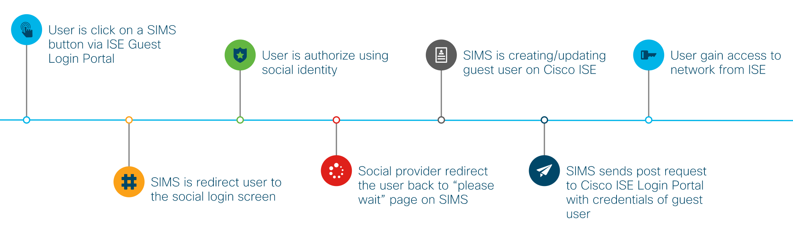

# Social Identity Management Service
 SIMS is a very basic project aims to add social login as a method of authentication and authorization to wireless networks managed by Cisco ISE. It's built on top of Node.js/Express and use Passport.js to easily add more than 500 social login strategies
## How It Works

## Prerequisites
For a quick start you'll don't need to have any network setup or equiqments, we will use the default configuration and test portals. so the must have list include only:
1. Cisco ISE v2.3+
    * In case you don't have Cisco ISE you can use one from DevNet sandbox or in case you have access, from Cisco dCloud where you'll even get a nice network setup to start with
2. `Desktop`/`VM`/`Server` with Node.js v8.9.3+/Docker installed
    * Machine must have network access to Cisco ISE primary node
    * SIMS is cross platform app but the instructions below written in Unix (or OS x) flavor
## Installation
```bash
# Clone this repository
$ git clone https://github.com/CiscoDevNet/ise-social-login-guest-authentication.git

# Go into the repository
$ cd sims

# Install dependencies (skip it in case you plan run on docker)
$ npm i
```
## Config
SIMS is using environment variables for configuration. the easiest way to manage and persist them is using the `.env` file sits on the root project directory

Configuration in the file is splitted to three parts, listed below
#### Project Settings
```javascript
NODE_TLS_REJECT_UNAUTHORIZED=0 // Get access to Cisco ISE with no SSL cert installed
HOSTNAME= // Hostname that we will run our server, used for callback redirection
PORT= // Port we will run our server
```
#### Cisco ISE Details
```javascript
ISE_ADDRESS=// IP Address of our Cisco ISE PAN node
ISE_SPONSOR_USER_NAME=// Sponsor user that will create our guest users
ISE_SPONSOR_PASSWORD=// Password for the sponsor user
SPONSOR_PORTAL_ID= // Sponsor portal that guest will be part of
GUEST_USER_LOCATION=// The location where the guest user created
```

#### Social Strategies Config
SIMS is use by default five social login strategies. For strategies modifications refer to [Add/Remove Login Strategies](#addremove-login-strategies) section below. Pay attention that missing config property will fail the application
```javascript
LINKEDIN_CLIENT_ID=
LINKEDIN_SECRET=
GITHUB_CLIENT_ID=
GITHUB_SECRET=
GOOGLE_CLIENT_ID=
GOOGLE_CLIENT_SECRET=
TWITTER_CONSUMER_KEY=
TWITTER_CONSUMER_SECRET=
AUTH0_CONSUMER_KEY=
AUTH0_CONSUMER_SECRET=
AUTH0_DOMAIN=
```

> `.env` file is listed as `.gitignore` file to avoid commiting of sensitive data to source control


## Usage
### Run the project
#### Node.js
From the project directory, Run:

* `npm start` _for a quick up'n'running_
* `npm run dev` _to use nodemon and modify the code in realtime_

#### Docker
This project has both `Dockerfile` and `docker-compose.yml` files to allow plain docker and docker-swarm running env


From the project directory, Run:

* `docker build . && docker run` to build docker image and run it
* `docker-compose up --build` to use it as a swarm service just run
### Use on ISE
#### ISE ERS Setup
##### Enable ERS for read/write on ISE on the Admin Portal
*  _Go to_: `Administration > System > Settings > ERS Settings`
*  _Select_: `Enable ERS forRead/Write`
*  _Click_: `Save`
##### Create ERS sponsor user for ISE
*  _Go to_: `Administration > Identities > Users`
*  _Click_: `Add`
*  _Insert_: `Name` (Usually sponsor-api)
*  _Insert_: `Password` (Choosen password)
*  _Select_: `ALL_ACCOUNTS (default)` at `User Groups` dropdown
*  _Click_: `Submit`
##### Enable ERS access for sponsor group
*  _Go to_: `Work Centers > Guest Access > Portals & Components > Sponsor Groups > ALL_ACCOUNTS (default)`
*  _Check_: `Access Cisco ISE guest accounts using the programmatic interface (Guest REST API)`
*  _Click_: `Save`
#### Get project config variables
##### Get the portal ID
*  _Go to_: `Work Centers > Guest Access > Portals & Components > Sponsor Portals > Sponsor Portal (default)`
*  _Click_: `Portal test URL`
*  _Copy_: `portal` value from the address bar (should look like `5d6c7720-f612-43df-ad36-ecfb166de8be`)
*  _Paste_: `portal` value on `.env` file
##### Create guest location (no need in case your code running on PST)
*  _Go to_: `Work Centers > Guest Access > Settings > Guest Locations and SSIDs`
*  _Insert_: `Location name:*` (Free text)
*  _Choose_: `Time zone:*`
*  _Click_: `Add`
*  _Click_: `Save`
*  _Paste_: `location name` value on `.env` file
#### Add the button to ISE
> The sample below will add all the five default login methods to the portal, refer to [Add/Remove Login Strategies](#addremove-login-strategies) section for more info
*  _Go to_: `Work Centers > Guest Access > Portals & Components > Guest Portals > Self-Registered Guest Portal (default)`
*  _Click_: `Portal Page Customization`
*  _Scroll_: `Instructional Text` section
*  _Click_: `Toggle HTML Source` (a button with icon looks like `<>` appear on the bottom row of the editor sidebar)
*  _Paste_:
    ```html
    <button onclick="window.location.href='http://localhost:3001/auth/google'+window.location.search+'&iseAddress='+window.location.host+'&token='+document.getElementsByName('token')[0].value">Login with Google</button>
    <button onclick="window.location.href='http://localhost:3001/auth/twitter'+window.location.search+'&iseAddress='+window.location.host+'&token='+document.getElementsByName('token')[0].value">Login with Twitter</button>
    <button onclick="window.location.href='http://localhost:3001/auth/linkedin'+window.location.search+'&iseAddress='+window.location.host+'&token='+document.getElementsByName('token')[0].value">Login with LinkedIn</button>
    <button onclick="window.location.href='http://localhost:3001/auth/github'+window.location.search+'&iseAddress='+window.location.host+'&token='+document.getElementsByName('token')[0].value">Login with Github</button>
    <button onclick="window.location.href='http://localhost:3001/auth/auth0'+window.location.search+'&iseAddress='+window.location.host+'&token='+document.getElementsByName('token')[0].value">Login with Auth0</button>
    ```

### Test the flow
*  _Go to_: `Work Centers > Guest Access > Portal & Components > Guest Portals > Self-Registered Guest Portal (default)`
*  _Click_: `Portal Test URL`
*  _Click_: `Login with GitHub` (or any other method you have)
*  _Login_: with your social credetials
*  _Authorize_: usage of your ISE social app
*  _Wait_: for user creation
*  _Click_: `Accept`
*  _Navigate_: back to ISE admin portal
*  _Go to_: `Work Centers > Guest Access > Manage Accounts`
*  _Click_: `Manage Accounts`
*  _Click_: `Managed Accounts` tab
*  _List_: your social identities as guest user


### Add custom fields

### Add/Remove Login Strategies

### Troubleshooting
Location isn't fit
Custom field does not created
Passwords not match
